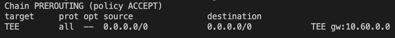
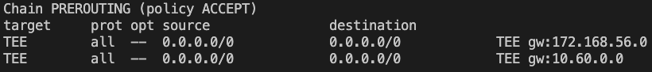

## ENV set

### Namespace: TSN
```shell
iptables -A PREROUTING -i enp0s9 -t mangle -j TEE --gateway 10.60.0.0
```



### Namespace: TSN2

`iptables -t mangle -F PREROUTING # flush`

```shell
ip addr add 172.168.56.2/24 dev enp0s10

iptables -A PREROUTING -i uesimtun0 -t mangle -j TEE --gateway 172.168.56.0

iptables -A PREROUTING -i enp0s10 -t mangle -j TEE --gateway 10.60.0.0
```
